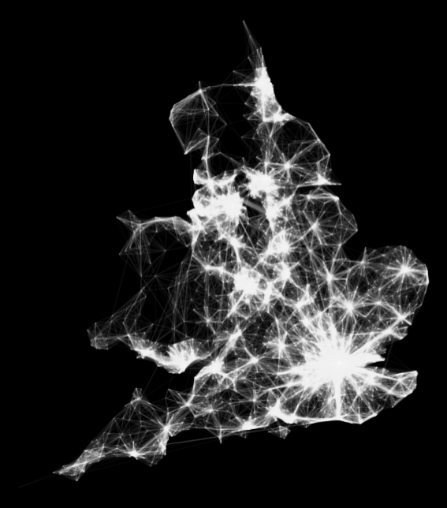

## Overview

> 1. Recap traditional visualization methods
> 2. Techniques for advanced visualizing
> 3. Examples
> 4. Summary
> 5. For you...

--- bg:#FFFFFF

## Recap visualization methods(traditional)

```{r echo = T}
data1 <- read.csv("1_data_generated.csv",header = T)
head(data1, 10) # The first 10 rows in data1

```


--- &twocol bg:#FFFFFF

## Recap visualization methods(traditional)
```{r echo = T ,results="hide"}
head(data1, 10) # The first 10 rows in data1
```


*** =left

<div width = '720px'>
      <iframe sandbox="allow-scripts allow-forms allow-same-origin" src="http://monaen.github.io/marvelchinese/PlotCode/3D-show-wheel/index.html" marginwidth="0" marginheight="0" scrolling="yes" width='720px' height='600px' frameBorder='1'></iframe>
</div>


*** =right

- lines
- horizons
- areas
- stacked areas
- streamgraph
- overlapping areas
- grouped bars
- stacked bars
- bars
- donut


--- .segue .dark
## What data visualization really is?

--- bg:#FFFFFF


## Book Data

```{r echo = T}
data2 <- read.csv("2_Export_Num.csv",header = T)
head(data2, 6) # The first 6 rows in data2

```

--- .segue .dark

## Thinking about it in 10 seconds ......

--- &twocol bg:#FFFFFF

## Motion Chart
```{r echo = T ,results="hide"}
data2 <- read.csv("2_Export_Num.csv",header = T)
head(data2, 6) # The first 6 rows in data2

```
<h2 style="color:#E81515;">Radio</h2>


*** =left

<iframe sandbox="allow-scripts allow-forms allow-same-origin" src="http://monaen.github.io/marvelchinese/PlotCode/NVD3-Bar-Plot/Export_Num.html" marginwidth="0" marginheight="0" scrolling="yes" width='700px' height='300px' frameBorder='1'></iframe>

*** =right


- Proportional Information
- Tendency


--- bg:#FFFFFF

## Fruits Data
```{r echo=F, message=FALSE}
require(googleVis)
Fruits
```

--- &twocol bg:#FFFFFF

## Motion Chart

*** =left

```{r echo=FALSE, results='asis', message=FALSE}
require(googleVis)
M1 = gvisMotionChart(Fruits, idvar = "Fruit", timevar = "Year")
print(M1, tag = 'chart')
```

*** =right

- Checkbox
- ScrollBar
- Menu


--- .segue .dark

## More complex data ......

--- bg:#FFFFFF


## Geography Data
<br>
<h2 style="color:#E81515;">Warming up</h2>
```{r echo = T}
data3 <- read.csv("3_sell.csv",header = T)
head(data3, 6) # The first 6 rows in data2

```

--- bg:#FFFFFF

## Choropleth
<iframe align = "center" sandbox="allow-scripts allow-forms allow-same-origin" src="http://monaen.github.io/marvelchinese/PlotCode/chinaChoropleth/index.html" marginwidth="0" marginheight="0" scrolling="yes" width='700px' height='900px' frameBorder='1'></iframe>


--- bg:#FFFFFF

## Time for you
<h3 style="color:#E81515;">World Heritage Data</h3>
```{r echo = T}
data4 <- read.csv("whc-sites-2015.csv",header = T)
head(data4[,c(4,10,13,14,15,27,29)], 5) # The first 6 rows in data2

```


--- .segue .dark

## Thinking about it in 10 seconds ......

--- bg:#FFFFFF

## Symbol Map & Crossfilter
<iframe align = "center" sandbox="allow-scripts allow-forms allow-same-origin" src="http://monaen.github.io/marvelchinese/PlotCode/World-Heritage-List/World-Heritage-List/webpage/index.html" marginwidth="0" marginheight="0" scrolling="yes" width='800px' height='900px' frameBorder='1'></iframe>


--- .segue .dark

## Hmmmmm how about Network !!!

--- bg:#FFFFFF


<h2 style="color:#E81515;" align = "center">Facebook</h2>


--- .segue .dark

## Can we do that ......

--- bg:#FFFFFF
## Flights Data

```{r echo = T}
data5 <- read.csv("5_flight.csv",header = T)
head(data5, 3) # The first 3 rows in data2

```

--- bg:#FFFFFF

## Flights Data


<div style='float:left;width:40%;' class='centered'>
  
</div>

<div style='float:right;width:50%;'>
  <pre style = "width:600px;height:500px;overflow-x:scroll">
    library(ggmap)
    library(geosphere)
    library(rgdal)
    library(threejs)
    library(plyr)
    library(ggplot2)
    library(maptools)
    #######################################################################################
    # https://web.archive.org/web/20150405212054/http://spatial.ly/2015/03/mapping-flows/ #
    #######################################################################################
        
    input<-read.table("wu03ew_v1.csv", sep=",", header=T)
    input<- input[,1:3]
    names(input)<- c("origin", "destination","total")
    centroids<- read.csv("msoa_popweightedcentroids.csv")
    
    or.xy<- merge(input, centroids, by.x="origin", by.y="Code")
    names(or.xy)<- c("origin", "destination", "trips", "o_name", "oX", "oY")
    dest.xy<- merge(or.xy, centroids, by.x="destination", by.y="Code")
    names(dest.xy)<- c("origin", "destination", "trips", "o_name", "oX", "oY","d_name", "dX", "dY")
    
    # removes the axes in the resulting plot.
    xquiet<- scale_x_continuous("", breaks=NULL)
    yquiet<-scale_y_continuous("", breaks=NULL)
    quiet<-list(xquiet, yquiet)
    
    
    
    
    dest <- dest.xy
    dest.xy <- dest.xy[1:2000,]
    # build the plot
    # First we specify the dataframe we need, with a filter excluding flows of <10
    
    ggplot(dest.xy[which(dest.xy$trips>10),], aes(oX, oY))+
    
    # tells ggplot that we wish to plot line segments. The "alpha=" is line transparency and used below
      geom_segment(aes(x=oX, y=oY,xend=dX, yend=dY, alpha=trips), col="white")+
    
    # Here is the magic bit that sets line transparency - essential to make the plot readable
      scale_alpha_continuous(range = c(0.03, 0.3))+
      
    # Set black background, remove axes and fix aspect ratio
      theme(panel.background = element_rect(fill='black',colour='black'))+quiet+coord_equal()

  </pre>
</div>


--- bg:#FFFFFF

## Migration Data
```{r echo = T}
data6 <- read.csv("6_migration.csv",header = T, sep=";")
head(data6[,c(-1,-5,-10)], 3) # The first 3 rows in data2

```

--- bg:#FFFFFF


## Migration Data

<iframe align = "center" sandbox="allow-scripts allow-forms allow-same-origin" src="http://monaen.github.io/marvelchinese/PlotCode/example4_use_FB/index.html" marginwidth="0" marginheight="0" scrolling="yes" width='800px' height='900px' frameBorder='1'></iframe>


--- .segue .dark

## Just do it !!!

---

## Summary

> 1. Recap some traditional visualization methods

> 2. Advanced Techniques(Radio, Checkbox, ScrollBar, Menu, Choropleth, Symbol Map, Crossfilter)

> 3. Networks(Facebook, Flights, Migration)

--- .segue .dark


<h2 size = "4">Learning Object: <br> <br> Master the visualization techniques for <br> <br> different kind of data...</h2> 

<h3></h3>


--- bg:#FFFFFF


## For test
<h3 style="color:#E81515;" align = "center">Visualize Text Data</h3>

```{r echo = F}
data.frame(word = c("Peking opera","Confucius","Lion dance","Chinese","Pipa","Chinese knot","Dumplings","Couplet","Facial Makeup","Culture","Tang poetry"), counts = c(13443635,4352466,426534,2452436,34224555,7454635,3546546,73565436,873536,5693465,45678))
```


--- &carousel
## You may 

*** {class: active, img: "./final1.png"}
<!-- Bruce Lowell http://bruce.kus-numa.net/ -->
Words Count(Simple bar plot)

*** {img: "./final2.png"}
Words Count(Muilt bar plot)

*** {img: "./final3.png"}
Word Cloud

*** {img: "./final4.png", alt=""}
Bubble Cloud

--- .segue .dark


## But what I want you to do is ......

--- bg:#FFFFFF

## WordCloud(Animation)
<div align = "center">
<iframe align = "center" sandbox="allow-scripts allow-forms allow-same-origin" src="http://monaen.github.io/marvelchinese/wordcloud/index.html" marginwidth="0" marginheight="0" scrolling="yes" width='800px' height='900px' frameBorder='1'></iframe>
<div>

--- .segue .dark


## Thank you !!!

