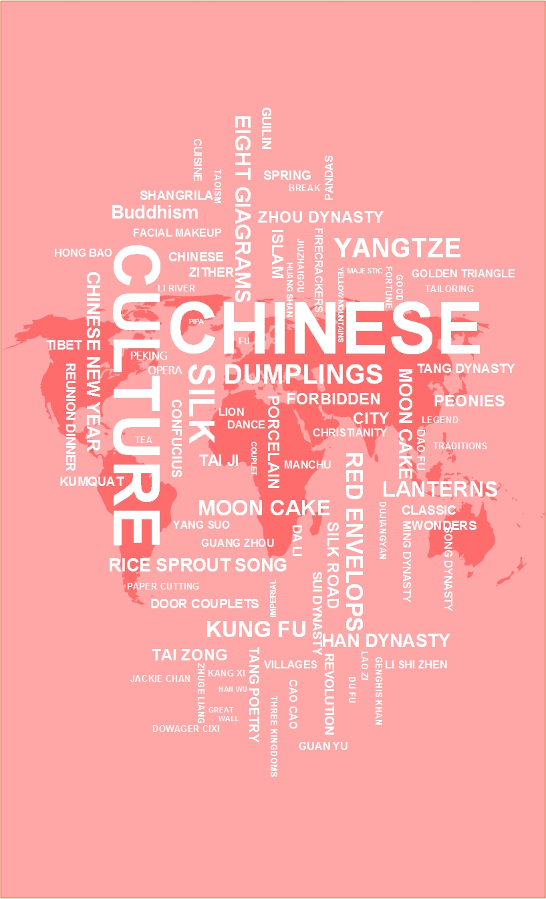

## Overview

1. Motivation
2. Literature review & Dataset
3. Framework
4. About Poster

--- .class #id 

## Motivation
The world has witnessed the rapid rising of China in the last decades. China is set to overtake Japan as the world's second-largest economy in a resurgence that is changing everything from the global balance of military and financial power to culture influence.

However, traditional research on chinese culture mostly based on the analysis in theory. Very few work is based on data but rarely known to people. The motivation of this project is aim at populizing the famous and recent work to people who have no professional background at all. Thus, we utilize data visualization techniques to simplify previous research and show the intuitive result to people all around the world.

---

## MarvelChina

[MarvelChina](http://marvelchina.site) is a data visualization project aimming at providing an intuitive view about the influence of chinese culture.(how powerful chinese culture is...)

  

---

## Literature review & Dataset

This project is based on several previous work focus on different aspects of chinese culture.

> 1. Michel, Jean-Baptiste, et al. science(2011) investigated the cultrue trend quantitively based on digitized books.

> 2. Schich Maximilian, et al. science(2014) focused on the emergent processes driving culture history.

> 3. Maximilian Schich, et al. A network framework of cultural history

Dataset

> 1. World Heitage data

> 2. China YearBook

> 3. Famous people migration

---

## Framework

The framework of this project is as follows:
> 1. From different aspects including chinese corpus, digital books, movies and world heritage, we made a comparison of chinese culture with other culture. (Show the increasing influence of chinese culture)

> 2. For the district difference, we compare the difference among different regions of china to show which city make the most contributions of china.

> 3. For the network part, we show the increasing rate of chinese famous people migrating to other places(and as a result influencing famous people in others places migrating to china.)

---

## Poster Idea

Some example poster:

  

